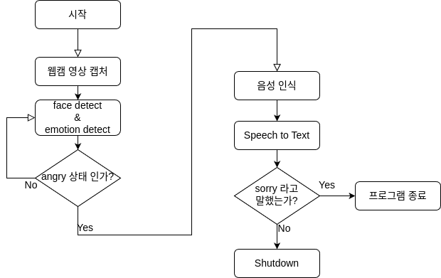
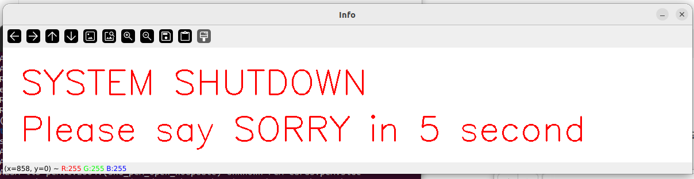
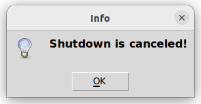

# Don't angry mini-project
## Team members
1. 최재혁
2. 이지원
## Purpose
- 게임을하거나 인터넷 작업을 할때 사용자의 표정이 화난 표정이 되면, 강제로 PC를 shutdown시킵니다. <br/>
- 5초안에 음성으로 sorry라고 말하면 shutdown을 취소할 수 있습니다.

## Require Models
- 안면 감지 모델 - interactive_face_detection_demo<br/>
- 감정 감지 모델 - interactive_face_detection_demo<br/>
- 소리 감지 모델 - speech_to_wav2vec-demo<br/>

## Environment and require package
open model zoo 환경<br/>
pyaudio<br/>
tkinter<br/>
ffmpeg<br/>

## System FlowChart


## How to Run
1. 환경 설정 및 요구 패키지 설치
2. omz downloader로 필수 딥러닝 모델 다운로드
```
omz_downloader --list models.lst --precision FP16
```
3. 모델 컨버트
```
omz_converter --list models.lst --precision FP16
```
4. .sh파일 실행 시 시작됨
```
./run_sc.sh
```

## Result
<br/>
<br/>


